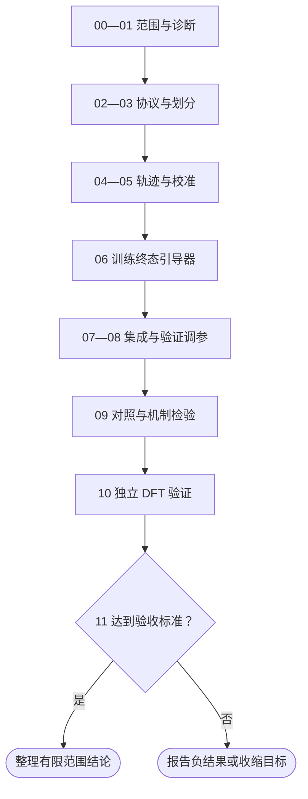

# BasinGuide：研究方案总结与执行计划

_CGDiT 晶体生成项目 · 2026-09-13 · 将讨论中的研究构想整理为按依赖顺序执行的工作手册_

---

## 📋 一页总结

BasinGuide 的目标是解决一个具体问题：**生成时性质达标，物理弛豫后却不达标**。第一版以带隙为例，不追求同时解决全部性质、稳定性或可合成性问题。

常规性质引导问：“这个结构现在的带隙是否接近目标？”BasinGuide 改问：“从这个结构出发，按约定流程弛豫后，终态带隙是否会达标？”通过弛豫轨迹提供终态监督，在扩散采样过程中引导结构进入更可能产生达标终态的区域。

| 项目 | 本方案的含义 |
| --- | --- |
| 研究对象 | 固定成分条件下的晶体结构生成，第一版只引导坐标与晶格 |
| 核心模型 | 识别弛豫终态是否达标的、扩散时间条件化概率引导器 |
| 核心监督 | 同一可靠弛豫轨迹上的结构共享终态标签 |
| 采样方式 | 冻结 CGDiT，增加终态概率梯度引导；不是仅在生成结束后筛选 |
| 最终证据 | 独立 DFT 弛豫后的带隙达标率，以及达标且独特终态的产出效率 |
| 必须战胜的基线 | 瞬时性质引导、终态预测后筛选、无一致性终态引导、完整快速弛豫后筛选 |
| 不做的事情 | 第一版不重训生成器、不引入 PPO/GRPO、不处理离散元素梯度、不声称保证合成 |

状态说明：BasinGuide 是讨论中提出的方案名，不是本仓库已实现的方法，也不是已验证的论文结论。本次只形成文档，未训练模型、修改采样器或提交计算任务。后文的产出文件均为计划中的文件。

## 🎯 问题、目标与创新边界

### 具体要解决什么

设生成结构为 \(C\)，固定协议下的弛豫算子为 \(R\)，性质计算为 \(P\)，目标值为 \(p^\star\)，允许误差为 \(\epsilon\)。

常规即时目标是：

\[
|\widehat P(C)-p^\star|\leq\epsilon.
\]

真正的终态目标是：

\[
|P(R(C))-p^\star|\leq\epsilon.
\]

两者可能不同：生成器或性质引导器可能利用偏离平衡的键长、体积和局部配位使预测达标，而弛豫抹掉这些变化后，终态不再达标。这只是待诊断的一种机制，不能在尚无实验时认定是本项目的主要原因。还需要区分预测器误差、结构无效、弛豫失败和真正的性质变化。

示例任务可设为终态带隙 \(3.0\pm0.5\,\mathrm{eV}\)。这个区间仅是讨论示例；必须先检查训练数据覆盖和可达性，再在正式评估前冻结区间，不能根据测试结果改目标。

成功标准：在同一任务、候选数量、筛选规则与可比较计算预算下，BasinGuide 提高独立 DFT 终态达标率，并且提升不是只来自更大量的数据、牺牲多样性或额外的弛豫筛选。

### 为什么采用“盆地”视角

在固定成分和弛豫协议下，不同初始构型可能收敛到同一个局部极小值。这里的“盆地”指该协议下共享终态的初始结构集合，不代表找到全局基态，也不具有跨优化器、势函数、磁性设置的普适性。

BasinGuide 希望区分两个容易混淆的样本：

- 假阳性：生成态预测带隙达标，但弛豫终态不达标
- 可恢复正例：生成态预测带隙不达标，但弛豫终态达标

后者也应得到正向引导，不能因为生成态看起来不达标就全部丢弃。

### 哪些内容可能形成贡献

候选贡献是“终态标签、经验证的弛豫轨迹一致性、扩散状态引导”的组合及其在晶体生成中的实际收益，而不是给分类器引导换一个名字。分类器梯度引导已有经典工作；终态价值引导和非可微奖励引导也已有通用方法。[^1][^2]

已有相关工作不能被忽略：Cryslator 研究未弛豫到弛豫结构的映射；DeepRelax 研究直接预测弛豫结构；Chemeleon2 使用强化学习控制晶体生成，并评估性质引导结果。因此不能把“考虑弛豫”或“优化生成性质”本身声称为首创。[^3][^4][^5]

本方案的独特性必须用实验回答：相同终态标签只用于后筛选是否已经足够？不加轨迹一致性的终态引导是否同样有效？如果答案为是，应收缩贡献，不宣称盆地学习不可替代。

## 📚 方法定义与训练方案

### 标签与两套评价器

物理弛豫索引记为 \(k\)，扩散时间记为 \(t\)，两者不得混用：

\[
C^{(0)}\rightarrow C^{(1)}\rightarrow\cdots\rightarrow C^*.
\]

终态达标标签为：

\[
z=\mathbf 1\bigl[|P(C^*)-p^\star|\leq\epsilon\bigr].
\]

第一版采用分层证据，避免把代理模型输出冒充物理真值：

| 层级 | 弛豫与性质 | 用途与限制 |
| --- | --- | --- |
| 快速训练标签 | \(R_{\mathrm{MLIP}}\) 弛豫，\(\widehat P\) 预测其终态带隙 | 扩大训练集；只能称代理终态标签 |
| DFT 校准标签 | 固定 \(R_{\mathrm{DFT}}\) 和 \(P_{\mathrm{DFT}}\) | 在训练/验证划分内检查代理偏差，必要时校准或微调 |
| 独立最终评价 | 未参与训练与调参的候选，按冻结的 DFT 流程评价 | 判断研究目标是否真正实现 |

MLIP 是机器学习原子间势，负责能量、力与弛豫；带隙通常由独立性质模型或电子结构计算提供，不能默认原子间势可以直接预测带隙。

必须固定最终评估到底是“生成结构直接 DFT 弛豫”，还是“先 MLIP、再 DFT 弛豫”的复合流程。二者的终态可能不同；所有方法使用同一流程，训练标签记录对应协议。推荐先将直接 DFT 弛豫作为科学目标，MLIP 仅作训练代理；若资源迫使使用复合流程，结论明确限定为该流程。

同一 MLIP 轨迹共享的代理标签，不能直接当作同一 DFT 盆地的真标签。轨迹中间帧是否在所用协议下返回同一终态，要通过重启弛豫抽检；不满足的配对不用于一致性约束。未收敛、崩溃和性质计算失败单独记录，不静默混入正负标签。

### 时间条件化引导器

从带终态标签的结构构造与 CGDiT 相匹配的扩散噪声输入，训练：

\[
g_\phi(C_t,t)\approx\Pr(z=1\mid C_t,t).
\]

这是训练分布下的终态成功概率估计，不是对任意噪声结构的物理保证。噪声结构不是物理弛豫中间态，不能把去噪路径解释为真实材料演化路径。

最小模型优先复用 CGDiT 表征与时间嵌入，新增二分类读出。先冻结表征，仅训练读出；如果验证集表明无法识别终态，再在预设预算内小规模微调引导器副本。无论哪种方式，生成器参数保持冻结，基线使用相同架构和训练预算。

训练损失：

\[
\mathcal L=\mathcal L_{\mathrm{terminal}}+\lambda\mathcal L_{\mathrm{consistency}}.
\]

- \(\mathcal L_{\mathrm{terminal}}\)：带噪输入预测终态标签的二元交叉熵；处理类别不平衡，并保留真实分布验证集进行概率校准
- \(\mathcal L_{\mathrm{consistency}}\)：只对已验证共享终态的干净/低噪轨迹配对约束终态输出；用有限权重，不要求所有隐藏表征完全相同
- 高噪阶段：主要采用标签监督；同盆地不同干净结构的带噪后验未必相同，不强制全时间尺度概率严格一致
- 边界样本：代理带隙接近阈值、势函数明显分歧或未可靠收敛的样本，标记不确定；阈值带宽只在验证集确定，必要时送 DFT

训练采样以原始结构/轨迹为单位加权，避免长轨迹因为帧多而获得过高权重。假阳性与可恢复正例可用于训练富集，但独立评估必须保留原始发生率。

### 采样中的使用方式

概念上在反向扩散更新中加入：

\[
\Delta C_t\propto s(t)\nabla_{C_t}\log g_\phi(C_t,t).
\]

这不是可以直接照抄的 CGDiT 更新公式。坐标 score、晶格噪声预测和离散元素使用不同过程，必须按真实采样器推导各通道的符号、缩放和更新位置。

第一版只给连续坐标与晶格增加引导，使用较少的引导时间点和验证集选定的强度，保留生成器自身去噪先验。引导梯度需投影到独立对称自由度，坐标保持周期性，晶格保持现有晶系/空间群参数化约束。采样后检查几何有效性，不将有效性检查解释为稳定性保证。

干净盆地标签可能分段常数且在盆地边界不连续，直接对完整收敛弛豫器求导未必提供有效跨盆地方向。因此第一版学习带噪状态的成功概率，不反向传播整个收敛优化过程。梯度确实能改变终态分布这一点仍需实验验证。

## 📍 按顺序执行的总计划表

没有上一步的验收产物，不启动依赖它的正式阶段。表中数量、超参数和预算需在预实验后记录，不能把示例规模当作已经完成的实验。

| 顺序 | 实际工作 | 必交产出 | 验收或停止条件 |
| --- | --- | --- | --- |
| 00 | 冻结第一版范围，登记生成器、数据、性质模型和可用 DFT 协议 | 范围与资源清单 | 单性质、有限化学空间、原子数上限、固定成分任务可执行 |
| 01 | 从现有 CGDiT 生成未筛选候选，比较生成态与弛豫终态 | 诊断配对表、失败分解 | 若未发现值得解决的达标损失，停止这一选题 |
| 02 | 固定快速与 DFT 评价协议，做小批交叉校验 | 协议版本、代理偏差报告 | 不把代理标签当 DFT；严重失配时先解决标签问题 |
| 03 | 制定分组划分、目标区间和预算，登记正式实验规则 | 划分清单、评估预登记 | 同源/同轨迹/同终态不跨集合；测试集不调参 |
| 04 | 生成训练候选、执行快速弛豫、保存轨迹与终态标签 | 轨迹数据与标签清单 | 保留原始候选和失败；覆盖正例、负例与难例 |
| 05 | 中间帧重启检查、终态匹配、训练/验证 DFT 校准 | 一致性配对、校准标签 | 仅可靠同终态配对参与一致性；校准不使用最终测试候选 |
| 06 | 训练终态引导器及同预算对照，分扩散时间评价 | 权重、校准曲线、验证结果 | 引导器能识别终态而非只复现即时性质 |
| 07 | 在冻结采样器中接入连续通道引导，完成单元和小批测试 | 最小采样改动、测试记录 | 零强度退化为原采样；无元素/对称性/周期性回归 |
| 08 | 在验证任务上选择引导时段、强度和一致性权重 | 冻结配置与预算账本 | 只用验证集选择；无效结构或模式坍塌不能被隐藏 |
| 09 | 运行正式采样、强基线和消融，做机制及跨势检查 | 候选清单、代理结果、消融表 | 相同任务与预算下仍有收益；否则收缩或停止贡献 |
| 10 | 按预登记规则选取/随机抽取候选，提交独立 DFT 评价 | DFT 输入、任务索引、结果清单 | 同协议、同选取规则；失败进入分母；不按最终答案挑样本 |
| 11 | 汇总终态命中率、独特产出、成本与不确定性 | 最终报告与可复现清单 | DFT 收益成立且无明显多样性崩塌；不成立则报告负结果 |

前期顺序是“先诊断，再冻结协议与划分，再规模化建数据”，不是一开始就训练新模型。阶段 03 的分组规则先冻结；阶段 04—05 发现新增同终态关联后，应合并整个分组并重新生成划分清单，而非把关联结构留在不同集合。



## ✍️ 分阶段操作细则

### 00—03：先把问题与评价标准固定

1. 第一版建议限制到不超过 20 原子的结构、一个带隙任务和较易处理的化学空间；不默认所有含某元素的体系都非磁，也不默认 PBE 带隙等于实验带隙。
2. 使用多个固定成分任务，登记原子数、成分、空间群/Wyckoff 模板和生成条件；所有方法共享这些条件。这是条件结构设计验证，不能直接宣称已经解决无限化学空间的从头生成。
3. 先做数百个候选量级的快速诊断，辅以预算允许的小批随机 DFT 抽检。数量是启动建议，不是统计功效承诺；同时保留失败样本。
4. 对同一候选记录生成态预测带隙、生成态 DFT 单点带隙（若计算）、终态代理带隙和终态 DFT 带隙（若计算）。这样可以区分模型误差和实际弛豫引起的漂移。
5. DFT 协议至少登记泛函、赝势版本、截断能、k 点规则、是否加 U、自旋/磁性设置、结构与电子收敛标准、带隙提取流程和失败重试规则。
6. 定义成功分母、候选筛选规则、唯一性匹配阈值、随机种子、调参范围与总预算。若采用稳定性附加筛选，所有方法使用相同标准，单列其影响。

快速评价的发现只能支持继续研究，不能替代最终 DFT 结论。

### 04—05：构建可追踪的终态监督

1. 数据包含未筛选 CGDiT 候选，以及参考结构的受控扰动。只用已知好结构做微扰，容易得到单一盆地内的简单任务，无法证明能纠正真实生成失败。
2. 对每个候选保留初始 CIF、实际弛豫设置、过程快照、终态、收敛状态、能量/力摘要、即时与终态性质预测。
3. 控制每条轨迹的取帧数，覆盖早期、变化较大位置和终态附近；不必保存每一步的大型全量张量。
4. 通过终态结构匹配、能量差和重启弛豫抽检建立近似盆地组。原子排序、晶胞等价和周期平移不能被误当成不同结构。
5. 同一来源、同一轨迹、同一匹配终态组及其噪声副本必须进入同一划分。报告与生成器预训练结构的重合情况，区分已知结构恢复和未见结构任务。
6. 至少报告分组留出结果；数据允许时增加成分或原型留出。后两者是更强外推测试，但不以样本过少的拆分制造不可靠结论。
7. DFT 校准候选来自训练/验证集合，包含随机样本及代理不确定样本；保留抽样来源，不能用最终 DFT 测试答案反过来选择引导参数。

数据记录最低字段：`sample_id`、`source_id`、`trajectory_id`、`basin_group_id`、`split`、成分、原子数、结构路径、扩散/弛豫协议版本、快照索引、终态路径、标签层级、连续带隙值、终态标签、收敛状态和失败原因。

### 06—08：训练并接入 CGDiT

1. 先训练仅终态标签版本；再加有限的轨迹一致性，保留相同训练数据。即时标签引导器也使用相同架构与样本预算。
2. 用相同前向噪声过程构造训练输入，评估低、中、高扩散噪声下的 PR-AUC、概率校准和终态预测能力。分类准确率不能单独作为验收。
3. 固定成分任务的元素通道仍可能在采样中被掩码/加噪，引导器训练输入必须匹配真实状态；不能训练时只见干净元素、采样时却输入掩码元素。
4. 采样引导在局部启用输入梯度，生成器与引导器权重不更新；避免保留整条计算图。检查引导梯度有限、非零且符号/量纲与各通道更新相符。
5. 测试引导强度为零时恢复原采样、固定元素计数与索引正确、周期平移等价、对称自由度投影正确、晶格有效，以及固定种子的可复现性。
6. 在验证集选择少量引导时段和强度；同时监测有效性、终态唯一性、实际计算成本。测试集只运行冻结配置。

### 09：必须做的对照与机制检查

| 方法 | 操作 | 回答的问题 |
| --- | --- | --- |
| B0：CGDiT 原始/已有 CFG | 不加 BasinGuide；已有性质条件另行报告 | 原模型已经能做到多少 |
| B1：即时性质引导 | 用生成态/瞬时性质标签训练时间条件引导器 | 终态标签是否优于传统引导目标 |
| B2：终态预测后筛选 | 同一终态模型只在生成后排序选取 | 采样干预是否真的优于筛选 |
| B3：无一致性终态引导 | 与完整方法相同轨迹数据，令一致性权重为零 | 轨迹一致性是否有独立贡献 |
| B4：完整快速弛豫后筛选 | 候选先做 MLIP 弛豫，再按终态预测筛选 | 学习引导是否比直接计算更划算 |
| B5：无轨迹扩充终态引导 | 每个来源只用初始帧，控制来源数与训练计算 | 收益是否主要来自轨迹数据扩充 |
| BG：完整 BasinGuide | 终态监督、有限一致性与采样内引导 | 完整方法的实际效果 |

B3 与 BG 必须共享轨迹帧，避免把增加数据误认为一致性损失的创新。后筛选基线可以在同样总成本下生成更多候选；不能只按相同采样数量比较，却忽略 BG 的额外反向计算。

机制检查采用成对实验：对同一参考终态做不同扰动，重启弛豫确认返回相同终态后，比较即时性质与终态预测的变化；再检查引导是否把真实失败初态转向达标终态。前者说明不敏感性，后者才说明有用的采样干预。

用第二个可用势函数复核部分候选，检查单势利用与协议依赖；这一检查是诊断，不是替代独立 DFT。若不同势对终态/性质排序分歧很大，优先评价这些分歧并限制结论。

### 10—11：独立 DFT 与最终验收

1. 正式候选与方法来源先登记，按冻结规则确定 DFT 清单；对每种方法均包含未按最终答案筛选的随机审计样本。
2. 区分未筛选产出率实验和固定 DFT 名额筛选精度实验。两者可以同时做，但不可混成一个百分比。
3. 所有方法使用同一 DFT 弛豫/性质流程和失败处理；保存输入、提交任务编号、最终结构、带隙与失败状态。
4. 按成分/来源组和独立采样种子报告结果与置信区间。聚类重采样应以独立组而非轨迹帧为单位；多个扰动帧不是多个独立材料。
5. DFT 收益若消失，则该方法尚未解决目标问题；若 B2/B3 已达到同等收益，则如实报告采样引导/一致性的贡献有限。

## 📚 当前仓库如何承接方案

以下是检查到的现有入口，不代表 BasinGuide 能力已经具备：

| 现有文件 | 已有能力 | BasinGuide 待做事项 |
| --- | --- | --- |
| [diffusion.py](../cgdit/pl_modules/diffusion.py) | `Diffusion.forward` 的前向噪声；`sample` 的连续/离散采样、CFG、`fixed_atom_types`、随机种子和轨迹选项 | 增加最小连续通道终态引导；匹配晶系投影、坐标对称性及实际噪声参数化 |
| [diffusion_backbone.py](../cgdit/prop_models/diffusion_backbone.py) | `DiffusionBackboneRegressor` 复用 CSPNet 表征；当前 `forward` 使用 `t=0` | 增加真实扩散时间与带噪状态输入；不能直接把现有回归器当时间条件终态模型 |
| [tc_classifier.py](../cgdit/prop_models/tc_classifier.py) | 基于上述骨干的二分类损失与指标 | 仅复用结构/指标思路；现有 high-Tc 语义不是 BasinGuide 的带隙终态标签 |
| [property.py](../cgdit/evaluation/property.py) | 从训练好的 `M3GNetSurrogate` 权重进行性质预测 | 登记具体带隙权重和适用范围；给初态/终态一致预测，但不充当 DFT 真值 |
| [stability.py](../cgdit/evaluation/stability.py) | `Relaxer`；`do_relax=True` 执行弛豫并返回终态及首末能量 | 增加受控步数、快照导出、收敛/失败记录和终态标签；现有 `do_relax=False` 只是零步单点 |

特别注意：`sample` 当前有 `@torch.no_grad()`；新增梯度引导必须局部开启梯度。现有晶格不是可随意相加的九维矩阵，而使用 `crys_fam` 六维参数及空间群投影。`fixed_atom_types` 使用内部零基元素索引，并不意味着整个离散通道始终处于干净状态。以上细节需要测试后才能确定最终接口。

建议后续产出按以下逻辑组织；这些路径是命名建议，本次未创建：

```text
docs/BasinGuide_research_plan.md       当前研究手册
data/basinguide/                      分组、轨迹、标签及版本清单
conf/basinguide/                      冻结训练与采样配置
output/basinguide/diagnosis/           生成态—终态诊断
output/basinguide/guide/               权重、校准和验证记录
output/basinguide/benchmark/           方法候选、消融与成本账本
output/basinguide/dft/                 DFT 输入、任务索引和结果
output/basinguide/report/              最终指标及可复现报告
```

不要为这些目录提前设计复杂框架；每个阶段只新增完成当前任务必需的脚本、配置和测试。

## 🎯 指标、成本与停止条件

### 主指标与分母

- 未筛选 DFT 终态命中率：在预登记的随机/全量评价候选中，终态达标数除以评价候选数；包含无效与计算失败，另报告仅收敛子集的条件命中率
- 生成总体产出率：只有全量评价或具有明确随机抽样设计与估计规则时才报告总体估计；不能用 top-k DFT 命中率代替
- 固定 DFT 名额的筛选精度：达标数除以按规定送 DFT 的候选数；同时报告此前生成与评分数量、成本
- 独特终态产出：按冻结结构匹配规则去重后的达标终态数量；同一盆地的许多初态不算许多发现
- 产出效率：独特达标终态数量相对于实际生成、评分、引导、弛豫与 DFT 成本；GPU 小时和 CPU 核小时分列，采用统一预算换算时说明依据

辅助指标包括初态假阳性率、可恢复正例率、生成态到终态带隙变化、收敛率、有效性、终态结构多样性及新颖性。新颖性取决于参考集合与匹配规则，不能仅凭不同 CIF 字符串认定。

成本账本需包含引导器训练及 DFT 校准成本，并分别给出一次性训练成本和重复使用的边际成本。预设调参预算也计入，避免无限调参方法与未调参基线比较。

### 何时停止或收缩

| 观察结果 | 应采取的结论/动作 |
| --- | --- |
| 本任务几乎没有弛豫后失配 | 停止当前问题设定，不能为方法制造问题 |
| 代理标签与 DFT 严重不一致 | 暂停扩大训练，检查协议、校准与化学范围 |
| 引导器只会识别同源结构 | 修复泄漏或报告局限，不宣称外推能力 |
| 只有高引导强度有效且严重坍塌 | 不算可靠改进，降低强度或停止 |
| 完整方法与后筛选同等效果 | 贡献限定为终态预测，不声称采样机制优势 |
| 一致性相对 B3 无收益 | 删除不可支持的一致性核心主张 |
| 代理改善但 DFT 不改善 | 尚未解决目标问题，报告代理利用/负结果 |
| 仅固定成分任务有效 | 结论限定为条件结构设计，不扩展到任意成分生成 |

DFT 带隙是特定计算协议下的性质，不等于实验带隙。局部弛豫收敛不等于全局稳定、动力学稳定或可合成。第一版的验收应坚持这个小目标，而不是附带扩大结论。

## ✍️ 计算批次与启动清单

计划中的计算批次按依赖提交，不能把所有未知输入的阶段无条件同时启动：

| 批次 | 对应阶段 | 提交前必须具备 |
| --- | --- | --- |
| A：诊断 | 01—02 | 生成器、性质权重、快速弛豫协议和小批 DFT 模板 |
| B：训练数据与校准 | 04—05 | 通过诊断验收；冻结分组规则、目标与预算 |
| C：引导器与对照训练 | 06 | 数据与标签清单通过检查 |
| D：验证采样与正式对照 | 07—09 | 单元测试通过；正式对照须等待验证配置冻结 |
| E：最终 DFT | 10 | 正式候选、抽样规则和统一评价协议冻结 |

同一批次内相互独立的任务可集中提交；有上游依赖的任务通过调度依赖或分批提交。凡需要根据科学验收决定是否继续的节点，不能靠任务依赖自动跳过判断。若后续要求“提交后不监督”，则每批保存任务编号与预期产出，待用户通知完成后再验收并进入下一批。本次没有实际提交上述任务。

启动前检查：

- [ ] 确认 CGDiT 与带隙预测权重、数据来源和版本
- [ ] 确认固定成分任务、原子数限制和空间群模板
- [ ] 完成生成态—终态损失诊断，而非只看预测分数
- [ ] 冻结 MLIP/DFT 弛豫流程和带隙计算协议
- [ ] 冻结目标、分组规则、预算与失败处理
- [ ] 保留未筛选分布与独立 DFT 审计样本
- [ ] 保证 B2 后筛选与 B3 无一致性对照不缺席
- [ ] 零引导、元素通道、对称投影和周期性测试通过后才正式采样

## 🔗 参考资料与阅读顺序

建议依次阅读：分类器引导原理 → 通用终态价值引导 → 弛豫结构映射 → 最新晶体性质控制工作，然后复查本方案的差异是否成立。下面文献用于界定已有方法，不表示作者提出了 BasinGuide，也不构成穷尽的新颖性审查。

[^1]: Dhariwal, P. & Nichol, A. (2021). “Diffusion Models Beat GANs on Image Synthesis.” https://arxiv.org/abs/2105.05233
[^2]: “Derivative-Free Guidance in Continuous and Discrete Diffusion Models with Soft Value-Based Decoding” (2024 preprint). 通用终态价值/非可微奖励引导的相关工作。https://arxiv.org/abs/2408.08252
[^3]: “A structure translation model for crystal compounds” (2023). *npj Computational Materials*. 弛豫前后结构映射的相关工作。https://www.nature.com/articles/s41524-023-01094-5
[^4]: “Scalable Crystal Structure Relaxation Using an Iteration-Free Deep Generative Model with Uncertainty Quantification” (2024 preprint). DeepRelax；弛豫终态预测的相关工作。https://arxiv.org/abs/2404.00865
[^5]: Park, H. & Walsh, A. (2026). “Guiding generative models to uncover diverse and novel crystals via reinforcement learning.” *Nature Machine Intelligence*. Chemeleon2；性质控制与强化学习的相关工作。https://www.nature.com/articles/s42256-026-01262-4

