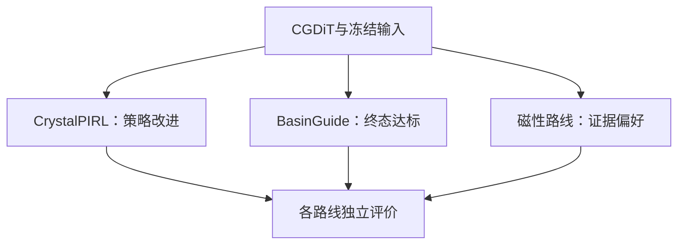

# 三条材料生成研究路线

_更新时间：2026-09-16。当前研究入口；既有文档保留为历史设计和逐次实验记录。_

---

## 📋 路线与阅读入口

| 路线 | 核心问题 | 当前阶段 | 详细计划 |
| --- | --- | --- | --- |
| CrystalPIRL | 如何减少性质驱动微调的退化更新并控制生成质量损失？ | PIPO三任务单种子200步完成；成对门控待科学对照 | [研究计划与进展](crystalpirl/研究计划与进展.md) |
| BasinGuide | 能否从生成态识别弛豫后真正达标的结构，进一步改善采样？ | 500候选中止后的配对诊断完成；引导器未训练 | [研究计划与进展](basinguide/研究计划与进展.md) |
| 高Tc证据驱动生成 | 能否用可信局部比较替代不可靠的全局Tc奖励器？ | 30材料偏好试点及200步复验；尚无Tc改善证明 | [研究计划与进展](magnetic_evidence/研究计划与进展.md) |

三条路线共享CGDiT、数据处理与结构评价工具，但优化对象不同：第一条优化策略更新，第二条预测并引导物理终态，第三条修正监督证据并进行局部偏好对齐。各自需要独立的基线、验收和结论。

## 📍 维护约定

- 每条路线只维护一份本目录下的综合计划，包含主线、创新假设、阶段、证据与下一步。
- 根目录旧计划、`docs/`、`agentic/docs/`和运行报告保留历史上下文，不再复制为临时总计划。
- 更新进展必须指向代码、配置或结果表；提交任务、生成文件和通过单元测试不等于科学目标成立。
- 新实验先记录输入、方法、种子、预算和成功条件，再补结果、失败和限制。
- 本次只整合既有资料，没有重新开展文献查新；创新点是待检验贡献，不宣称首次提出。

## 📦 文件与Git规则

完整约定见 [REPOSITORY_POLICY.md](REPOSITORY_POLICY.md)。代码、配置、必要输入和精简证据表进入版本管理；`output/`、`logs/`、`wandb/`、`tmp/`及`transfer/`保持本地。

新模型训练、结构生成和微调输出统一写入`output/`。历史`agentic/results/`布局本次不迁移；后续迁移时必须同时修正脚本读取路径。小型审计表可保留作为复现证据。

远程`tmp`已删除，本地分支及工作文件保留。2026-09-17发布范围仅为本轮规则和文档，目标为`newton`，不重新创建远程`tmp`，也不包含`tmp/`目录。其他本地代码、输入和结果须另行审核发布；文档中的本地证据链接不代表对应资产已上传。

## 🔧 Typora阅读

采用标准标题、表格、相对链接、`$...$`行内公式、`$$...$$`独立公式和基础Mermaid `flowchart`。在Typora中启用数学公式和Mermaid渲染；正文也完整描述流程，不依赖图片才能理解。

本次依据`markdown-mermaid-writing`的文档层级与文本流程图规范组织，科学内容来自项目证据。未在本机启动Typora进行视觉验收。
