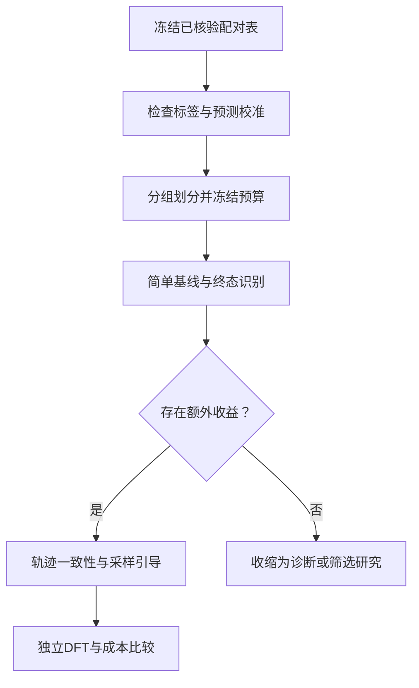

# BasinGuide：面向弛豫终态达标的结构生成

_更新：2026-09-16；路线二的当前综合台账。已完成中止计算后的诊断，尚未训练终态引导器。_

---

## 🎯 核心主线及本轮修正

研究目标是从未弛豫晶体出发，识别在固定物理协议下弛豫后会满足目标性质的结构，最终再检验能否将这种识别能力用于扩散采样引导。第一任务是带隙3.0 eV，达标区间固定为[2.5, 3.5] eV。

原方案强调“生成时达标，弛豫后失效”。最新数据表明，本轮主要问题是生成态预测与DFT不一致，同时还存在预测筛选遗漏的终态正例。因此先做终态达标识别与校准；不能把新结果硬解释为普遍的弛豫破坏。

设$C$为生成结构，$\mathcal R$为固定协议弛豫，$P$为对应终态性质：

$$
z(C)=\mathbf 1\left[\left|P(\mathcal R(C))-3.0\right|\leq0.5\right].
$$

研究对象是$z(C)$，不是仅让生成态预测器$\widehat P(C)$接近目标。不同赝势、泛函、磁性初始化或优化器下的终态可能不同，标签必须带协议版本。

## 💡 创新候选及证伪条件

| 层次 | 候选贡献 | 必须排除的简单解释 |
| --- | --- | --- |
| 诊断 | 分离生成态预测误差、真实弛豫效应和未完成计算 | 不能用ML初态与DFT终态之差代表纯弛豫效应 |
| 识别 | 利用生成态结构预测终态达标，减少漏检和假阳性 | 简单组成基线或预测器校准已经足够 |
| 方法 | 终态监督、经验证的轨迹一致性和时间条件化引导 | 收益只是多用数据、后筛选或额外计算 |
| 材料结果 | 同预算下提高独立DFT终态的达标且独特产出 | 只改善代理指标或重复生成同一终态 |

“考虑弛豫”“训练分类器”或方法命名不单独构成创新。初稿的相近工作与理论设计见[历史方案](../../docs/BasinGuide_research_plan.md)；本次不重新进行查新。若简单终态筛选已经达到同等效果，应收缩为终态识别贡献，不预设采样引导一定必要。

## 📊 当前完成情况与实际结论

依据[2026-09-16诊断报告](../../docs/BasinGuide_stopped_results_20260916.md)。本轮没有重启计算，没有训练BasinGuide模型。

### 实验输入

- 现有BG条件CGDiT，条件3.0 eV，guidance=1.0，原1000步采样日程。
- seed=42，共500个未经性质筛选的Ab initio候选，20个一批，最多20原子。
- 初态预测使用seed42 BG预测器。
- 原计划并列运行SevenNet弛豫和直接DFT分支；两条路径不能混为同一终态。
- 本轮主要结论来自回传的直接DFT中止归档，不能称500个完整物理验证全部完成。

### 数据可用范围

| 对象 | 数量 | 含义 |
| --- | ---:| --- |
| 全部生成候选 | 500 | 所有失败和未知都保留 |
| 初态预测达标 | 89 | 预测命中率17.8% |
| 可用初态DFT | 393 | 电子收敛且可解析 |
| 可用终态DFT | 322 | 收敛弛豫及终态SCF |
| 初态／终态DFT配对 | 315 | 可用于分析纯弛豫变化 |
| 终态DFT达标 | 21 | 21/322=6.52% |
| 无可用终态标签 | 178 | 未知，不作为不达标负例 |

### 三个独立问题

1. **初态预测可靠吗？** 393个可用初态DFT中，74个被预测达标，只有3个被初态DFT确认，精确率约4.1%；该子集初态预测MAE约1.911 eV。原因尚未分离为结构分布、标签语义或DFT设置差异。
2. **弛豫是否普遍损害达标性？** 315个配对样本的达标数由4增加到21，其中2个失去达标性，19个由不达标变为达标。当前证据不支持普遍破坏的表述。
3. **初态预测会漏掉终态正例吗？** 322个终态中，初态预测筛选保留9个正例、漏掉12个；召回率9/21=42.9%，所选55个中精确率9/55=16.4%。有富集作用，但漏检明显。

全部500候选中的已确认产出为21/500=4.20%，不是未完成结构补算后的真实命中率。21个样本也不是已确认独特、稳定或可合成的21种新材料。

## ⚠️ 证据限制与划分要求

- 统一中止使慢结构和同批后续结构更容易缺失，可用子集不是已证明的随机样本。
- 只有一个目标、一个生成种子和一个采样设置；不能据此推断整个生成器的普遍能力。
- 训练终态模型时同源候选、同条弛豫轨迹、同终态结构及噪声副本必须放入同一划分。
- 322个终态只有21个正例；不能把一条轨迹的许多帧当成许多独立正例来夸大样本量。
- 当前未补算同一BG预测器对全部可靠DFT终态的预测，尚不能比较其弛豫前后误差。
- 当前回传数据使用VASP 5.4.4，原服务器方案写6.3.1；分别记录，不与旧reference_results混合。
- 8个含W候选因缺W_pv跳过；不得用其他势变体静默替换后混入同协议结果。
- 单磁态、自旋极化、无SOC的PBE(+U)带隙不是实验带隙，也不代表完成磁性基态搜索。

## ⚙️ 方法路线：先识别，再考虑引导

若前置识别通过，再训练时间条件化终态概率：

$$
g_\phi(C_t,t)\approx\Pr(z=1\mid C_t,t),
\qquad
\mathcal L=\mathcal L_{\mathrm{terminal}}+\lambda\mathcal L_{\mathrm{consistency}}.
$$

终态标签用于分类，一致性仅施加在经过重启弛豫抽检、确认共享终态的配对上。MLIP共享终态不自动等于DFT共享终态，不能直接混用标签。扩散时间与物理弛豫步数是不同变量。

采样引导的概念方向为$\nabla_{C_t}\log g_\phi(C_t,t)$，但CGDiT各通道的更新符号和尺度必须分别推导。早期方案只调整坐标和晶格并投影到对称自由度；离散元素不直接使用连续梯度。该模块尚未实现和验证。

## ✍️ 下一阶段计划与验收

| 阶段 | 工作 | 产物／通过条件 |
| --- | --- | --- |
| B0 证据冻结 | 保留500候选、失败分类、协议与哈希 | 当前审计结果可复算 |
| B1 误差定位 | 对322个可靠终态补同一预测器结果，核对训练标签和DFT协议 | 分清初态分布误差与整体校准误差 |
| B2 基线与划分 | 按成分、结构和来源分组；冻结评价预算 | 不出现轨迹帧或同终态泄漏 |
| B3 最小识别试验 | 比较初态预测、组成基线、简单终态模型 | 同样选取数量下precision、recall与成本有额外收益 |
| B4 有条件扩展 | 增加可靠标签和轨迹，验证共享终态假设 | 正例与来源覆盖足以支持建模 |
| B5 引导与消融 | 冻结生成器，比较即时引导、终态筛选、无一致性版本和完整方法 | 零引导等价；对称/周期/有效性不回归 |
| B6 正式独立验证 | 固定规则选择各方法候选并执行DFT | 达标且独特终态产出改善，计入所有成本和失败 |

B1–B3是下一步研究建议，本次没有提交这些任务。现有中止归档按用户约定保留，不自动补算原500任务。

## 📈 论文证据与图表构想

| 内容 | 必要数据 | 状态 |
| --- | --- | --- |
| 问题诊断图 | 初态ML、初态DFT、终态DFT配对与失败流向 | 已有主要数据 |
| 终态识别图 | 分组留出precision/recall、校准、等数量筛选 | 待实验 |
| 机制图 | 终态监督、可靠轨迹一致性、时间条件引导 | 当前仅方案 |
| 生成对照图 | 同预算各方法的终态命中与独特产出 | 待实验 |
| 消融与物理图 | 无一致性、仅后筛选、MLIP直接筛选及DFT | 待实验 |

## 🔗 实现与复现资产

- 方案历史：[研究设计](../../docs/BasinGuide_research_plan.md)、[500候选协议](../../docs/BasinGuide_bg3_500_execution.md)。
- 执行与迁移：[诊断程序](../../scripts/basinguide_diagnostic.py)、[便携DFT说明](../../scripts/basinguide_transfer/README.md)。
- 回传审计：[归档提取](../../scripts/audit_basinguide_archive.py)、[统计重建](../../scripts/summarize_basinguide_stopped.py)。
- 本地逐样本表：`output/basinguide/analysis/stopped_20260914/samples.csv`；21个达标候选见同目录`target_hits.csv`。
- 完整回传压缩包：`tmp/basinguide_bg3_500_dft_stopped_20260914_155007.tar.gz`；审核证据目录只提取部分内容，不是可直接续算的完整目录。

发布时应分享精简的500候选输入、固定协议、逐样本表及失败标记；大型计算输出、模型、日志和迁移包不进入Git。保留外部资产位置和哈希；代码能重跑计算不等于当前仓库已经包含全部重建输入。
