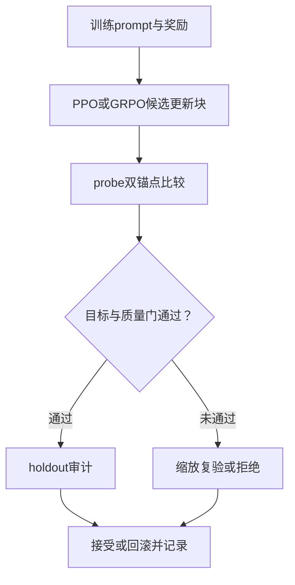

# CrystalPIRL：晶体扩散的可验证强化微调

_更新：2026-09-16；路线一的当前综合台账。依据本地代码、配置和已保存实验记录整理，尚非论文成功结论。_

---

## 🎯 核心主线与目标

从同一个冻结无条件Base出发，以形成能FE、带隙BG及FE+BG奖励进行扩散策略微调。研究的问题是：候选更新能否在独立于训练batch的比较中产生可重复收益，同时将有效性、稳定性、唯一性、新颖性和多样性的损失控制在预先约定的范围内？

目标性质可以与通用材料质量作有限妥协，通用质量不要求每一步都上升。但容忍量应相对冻结Base设定，避免每步允许一点下降造成累计坍塌。统计门控只能降低错误接受风险，不能保证每一步真实物性都提高。

当前先完成seed=42探索，再按固定设置补充其他种子。CFG-FE、CFG-BG、CFG-FE+BG用于外部条件生成对照，不作为本路线RL起点；Template结果用于工程诊断，文章生成质量与性质分布使用Ab initio结果。

### 三个方法角色

| 名称 | 作用 | 不能混同的内容 |
| --- | --- | --- |
| PPO／GRPO | 用终止奖励产生参数更新 | 一次训练loss下降不代表独立生成收益 |
| PIPO | 根据滑动历史奖励调制局部学习信号 | 不能将其训练结果标成CrystalPIRL |
| CrystalPIRL | 比较候选与当前策略、冻结Base，并执行风险验收 | 尚需证明额外验证成本值得 |
| OrbitPO | 对称约化的晶格、周期坐标、元素联合概率 | 是策略优化基础，不等于材料质量奖励 |

## 💡 创新假设与需要证明的贡献

| 候选贡献 | 必须提供的证据 | 否证或收缩条件 |
| --- | --- | --- |
| 跨batch可比较的材料奖励参与策略验收 | raw reward、advantage和独立评价分开；有效目标产率提高 | 只在训练预测器上提升则仅为代理优化 |
| 成对双锚点与质量容忍门 | 在同预算下减少坏更新、错误接受和累计退化 | 若额外查询解释全部收益，不能声称方法更高效 |
| 验收机制可跨优化器使用 | PPO和GRPO分别比较无反馈、PIPO、CrystalPIRL | 只有一个算法有效就限制结论范围 |
| OrbitPO排除概率计算混杂 | 重放一致性、ratio/KL、轨道多重度和子空间消融 | 工程正确不自动证明优于其他概率实现 |

普通PPO/GRPO、材料性质奖励或使用滑动历史本身不承担标题级创新。当前参考关系沿用[已有研究总览](../../CGDiT_RL_complete_research_plan.md)，本次未重新核验外部工作，不作优先权判断。

## ⚙️ 方法、奖励与验收

### 训练与验收分开

同一个prompt生成多条去噪轨迹，终态结构获得原始奖励。GRPO使用组内优势：

$$
A_{ij}=\frac{R_{ij}-\overline R_i}{s_i+\epsilon}.
$$

组内优势均值接近零是标准化的结果，不表示模型没有学习。应同时观察raw reward、目标误差、梯度、KL、参数变化与冻结策略生成结果。组内优势不能替代probe上的原始奖励差。

对目标型性质，常用固定尺度映射为：

$$
r_p(y)=\exp\left[-\frac{1}{2}\left(\frac{y-y_p^*}{\tau_p}\right)^2\right].
$$

实际FE探索配置是`mode: minimize`，BG是`mode: target`，不能把上述目标型公式当成FE当前执行定义。源定义见[奖励代码](../../cgdit/rl/rewards.py)和[探索奖励契约](../../conf/rl/components/rewards/contracts/mp20_seed42_pilot.yaml)。

| 参数 | 当前配置或证据 | 解释 |
| --- | --- | --- |
| FE奖励 | minimize，target=-1.5，tolerance=0.30 eV/atom | 奖励映射尺度不等于对称命中区间 |
| BG奖励 | target=2.0，tolerance=0.45 eV | 固定目标型奖励 |
| 联合奖励 | bottleneck | 最弱性质限制联合得分 |
| 训练规模 | 4 prompts × 16 trajectories | prompt微批次为1 |
| probe配置 | 32 prompts × 1 trajectory | 不代表已有充分统计功效 |
| PIPO历史 | window=8，negative_scale=0.1 | 滑动历史反馈 |
| CrystalPIRL验收 | verification_interval=10 | 当前代码允许连续候选更新后按块验收 |
| 原子数上限 | 当前相关配置为52 | 历史目录名max60不应代替实际配置 |

上述是当前配置快照；复现已有运行以该运行保存的实际配置为准。旧计划的FE“±0.06命中容差”是另一评价口径，不能自动替换训练映射尺度或用于混合统计。

### 双锚点和共同随机数

维护冻结Base $\pi_0$、最近已验收策略 $\pi_v$、候选策略 $\pi_c$。同一probe条件下复用初始噪声和后续连续／离散随机流，计算：

$$
\Delta_j^{\mathrm{local}}=R(C_j^{\pi_c})-R(C_j^{\pi_v}),
\qquad
\Delta_j^{\mathrm{base}}=R(C_j^{\pi_c})-R(C_j^{\pi_0}).
$$

目标是两个奖励差的下置信界都大于零，质量差不低于允许值：

$$
\operatorname{LCB}(\Delta R^{\mathrm{local}})>0,
\quad \operatorname{LCB}(\Delta R^{\mathrm{base}})>0,
\quad \operatorname{LCB}(\Delta Q_k^{\mathrm{base}})\geq-\delta_k.
$$

正式统计应按独立prompt／相关组重采样，保留同组轨迹相关性；该统计单位需要与实际bootstrap实现核对。反复查看固定probe会带来适应性选择，周期性holdout不能再被称为完全未参与选择的最终测试集。



当前pilot只验收`validity`和由seed123形成能预测器构造的稳定性代理。日志`formal_complete=true`仅表示该运行要求的指标齐全，不能等同于完整六指标安全门或DFT稳定性。代码已有holdout/rollback路径，仍需针对正式契约做验收，不能沿用旧计划“完全未实现”的描述。

## 📊 当前进展与证据边界

| 工作 | 实际证据 | 当前解释 |
| --- | --- | --- |
| 混合轨迹与概率重放 | `cgdit/rl/`及历史Gate测试 | 已接通工程链路 |
| 零引导、静态边与条件缓存 | 已提交代码及缓存测试 | 采样优化已实现；真实GPU加速比需独立测量 |
| PIPO-FE | 200条metrics，step 0–199 | 单种子长程探索完成 |
| PIPO-BG | 200条metrics，step 0–199 | 同上 |
| PIPO-FE+BG | 200条metrics，step 0–199 | 同上 |
| 早期标名200step的PIRL | FE、BG各仅8条metrics，step 0–7 | 不能按目录名认定完成200步 |
| block10配置与脚本 | 已存在 | 本次未找到对应完整200步结果链 |
| Fig. 1–4 | 有Base、CFG、PIPO和部分诊断Source Data | 缺失CrystalPIRL证据继续留空 |

完成运行位于：

```text
output/reinforcement_learning/2026-08-24/
├── 20-57-12-grpo-pipo-probe32-resume60/
│   ├── grpo_fe_seed42_pipo/
│   └── grpo_bg_seed42_pipo/
└── 20-57-12-grpo-pipo-joint-max60/
    └── grpo_joint_seed42_pipo/
```

step39的[S.U.N.诊断脚本](../../scripts/result_figures/crystalpirl_article_blueprint/analyze_sun_gain.py)及本地审计表将主要增益归于单质／二元组成占比与代理凸包稳定性变化。不能据此认定模型先优化通用奖励、之后才优化性质；当时训练奖励并未纳入S.U.N.三项。该结论也不能未经重算直接外推到step199。

缺少最终独立性质评价、多种子公平矩阵及完整质量门时，不能声称CrystalPIRL已经优于PIPO或实现真实材料性质提升。

## ✍️ 按依赖顺序执行的计划

| 阶段 | 工作与产物 | 通过条件 |
| --- | --- | --- |
| C0 冻结资产 | Base、预测器、划分、运行配置、输出指标和哈希清单 | 同一起点与评价口径可重建 |
| C1 验证成本 | 测量采样、预测、反传和验收的分项耗时 | 缓存等价；明确GPU时间与内存预算 |
| C2 已有结果复评 | step0/中间/step199同协议配对生成与独立评价 | 性质分布改善不是组成偏移或预测器偏差 |
| C3 小规模CrystalPIRL | block10、32 probe、4×16训练及holdout工程验收 | 区分候选步、接受块与回滚；完整记录失败 |
| C4 FE公平比较 | PPO/GRPO × plain/PIPO/CrystalPIRL，先seed42 | 同预算验证验收机制的额外收益 |
| C5 泛化与重复 | BG、联合目标、固定其他种子 | 不按结果选择最佳种子；方向与代价可解释 |
| C6 正式物理证据 | 冻结模型后独立评价，最后做消融和物理复核 | 代理、物理和多样性结论分别有证据 |

H2通道—时间归因和多保真在线闭环保留内部模块定位，当前不放入主文章贡献。新Base到达时需独立建立新基线，旧模型开发结果不重标为新轨道训练结果。

## 📈 文章图与所需数据

| 图 | 要证明什么 | 数据 |
| --- | --- | --- |
| Fig. 1 | 候选更新与验收的完整定义 | 策略角色、奖励、OrbitPO、块验收及失败路径 |
| Fig. 2 | 学习信号与策略改进可靠性 | reward、advantage、梯度、接受/拒绝/回滚、独立配对差、成本 |
| Fig. 3 | Ab initio性质控制及质量 | Base、三个CFG、各RL任务的逐结构FE/BG与质量表；KDE、二维分布 |
| Fig. 4 | 搜索空间与多样性 | 等量抽样嵌入、组成/空间群/原子数分布、coverage及多样性 |
| 后续消融／物理图 | 因果归因与真实材料效应 | 概率消融、同预算门控消融、独立MLFF/DFT验证 |

组分有效、结构有效、稳定、唯一、新颖及S.U.N.使用明确分母。S.U.N.按逐结构集合求交，不能把三个汇总比例相乘。代理形成能相图稳定性与DFT稳定性分开标注。重复使用的t-SNE和KDE只描述分布，不单独证明性质因果改进。

## 🔗 实现、资产与复现

- [训练入口](../../scripts/cli/training/train_crystal_rl.py)、[策略验收](../../cgdit/rl/policy_improvement.py)、[PIPO](../../cgdit/rl/pipo.py)、[概率模块](../../cgdit/rl/transition_logprob.py)。
- [block10配置](../../conf/rl/experiments/grpo_fe_seed42_crystalpirl_block10.yaml)、[预测器登记](../../conf/rl/components/rewards/registries/mp20.yaml)。
- [历史文章设计](../../CrystalPIRL文章执行计划.md)、[研究总览](../../CGDiT_RL_complete_research_plan.md)。
- 本地图片与冻结表：`assets/crystalpirl_article_blueprint/`；绘图入口：[plot_blueprints.py](../../scripts/result_figures/crystalpirl_article_blueprint/plot_blueprints.py)。

Git应提供精确MP20输入与划分、代码、配置和小型Source Data。基础模型、奖励模型、RL checkpoint及运行输出另行取得或按记录重训；不上传`output/`。下一步优先C1与C2，先确认已有200步学习是否转化为可靠生成改进，再投入更大矩阵。
