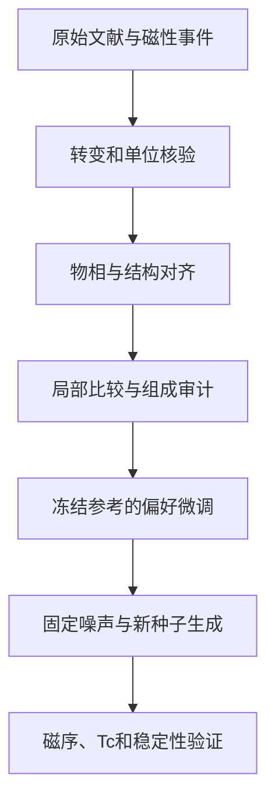

# 高居里温度材料：证据驱动的晶体偏好生成

_更新：2026-09-16；路线三的当前综合台账。实现集中在agentic；当前为证据审计和受限偏好试点。_

---

## 🎯 核心主线

当全局Tc预测器不足以提供可信奖励时，先核验文献中的磁性转变事件、物相、结构和温度语义，将确定的局部大小关系转化为可比较结构对，再直接微调CGDiT。目标是在证据适用范围内改善高Tc生成，而不是让语言模型给未知结构编造温度。

FM／FiM到PM的有序转变、AFM转变、自旋重取向与补偿温度需要区分。仅看Tc／TN／Curie／Néel字样不能完成判定，要联合上下文和低温磁序。相同结构对应多种事件时不简单取最大值或平均。

本路线不同于CrystalPIRL的在线轨迹奖励微调：当前主要使用离线结构偏好与冻结参考去噪评分。Base和BG条件模型分别作为试点骨干，后者用于监控原有带隙条件响应；这是本路线的设计，不改变CrystalPIRL从无条件Base开始的规定。

## 💡 创新假设与贡献边界

| 假设 | 需要的证据 | 不能替代的证据 |
| --- | --- | --- |
| 转变事件语义能改善监督 | 干净金标准、错误类型与标签污染压力测试 | LLM格式通过不等于物理标签正确 |
| 区间／上下界偏序比强行单值化更适合稀缺标签 | 同信息量的回归、SFT与偏好对照 | 给主方法更多文献不能算算法收益 |
| 局部结构约束减少组成捷径 | 来源分组评价、组成基线、反向比较与家族留出 | 降低单个Fe比例基线不等于消除所有混杂 |
| 偏好更新改善实际生成 | 多训练种子和新生成种子的结构与物理评价 | 权重变化、loss下降、生成变化都不等于Tc提升 |

文章候选贡献是“转变语义核验—可辨识局部偏序—受限生成对齐—适用范围拒绝”的证据链。LLM调用、普通偏好损失、数据清洗或磁体生成本身不作为首创声明。已有相近工作与设计边界保留在[原提案](../../agentic/docs/tc_research/PROPOSAL.md)，本次未重新查新。

## ⚙️ 证据和训练定义

### 从证据到比较对

每个事件至少保存：材料和物相ID、结构ID、转变前后磁序、温度值/单位、上下界、压力与样品条件、DOI、原文页表/短引文、审核状态和冲突原因。

若同家族两个事件区间满足：

$$
L_a>U_b+\delta,
$$

才可建立$a\succ b$；$\delta$是预先设定的比较间隔，不伪装成文献没有提供的测量误差。区间重叠或物相无法匹配就弃权。相对优于低温材料不自动构成达到500 K的证据。

比较图应限制节点度并按来源分组。由同一论文、同一系列派生的多条边相互相关，不是独立样本。原子坐标缺失、无序占位或实验相身份不明时，不把任意理想有序结构当成实验真值。

### 去噪偏好目标

设计中的相对去噪改进分数为：

$$
s_\theta(x,c)=\mathbb E_t\left[\ell_{\mathrm{ref}}(x_t,x,c)-\ell_\theta(x_t,x,c)\right],
$$

$$
\mathcal L_{\mathrm{pref}}=-\mathbb E\log\sigma\left(\beta[s_\theta(x^+,c)-s_\theta(x^-,c)]\right).
$$

这是去噪评分上的偏好目标；没有完整似然推导时不称严格晶体DPO。当前受限试点只更新`decoder.type_out`的51,300个参数，缓存冻结骨干特征并核对完整前向一致性。后续扩展参数范围须单独比较成本与生成有效性。

## 📊 当前进展：按证据强度整理

依据[agentic状态](../../agentic/STATUS.md)、[受控试点](../../agentic/docs/COUNTERSHORTCUT_PILOT.md)与运行报告。以下都是已保存记录，本次没有新增训练或提交任务。

### 数据和语义审计

- 已有30材料、50比较、6个来源组、8篇论文的结构控制试点。
- 新比较图有34条Fe原子分数相同边、16条正相关边，无反向边；最大节点度6。
- 训练Fe分数基线由98.94%降到67.02%，但主要来源依赖仍集中，不能称完全消除组成捷径。
- MAGNDATA路线核对74条带DOI记录，审核23个候选端点：14个明确非Curie、5个弃权、2个引文不精确，另有2个未通过模式/引文校验；最终没有可准入的Curie训练对。
- NdScO3的旧953 K与原记录0.953 K冲突，说明温度单位／小数和事件语义都必须审计。

### 40步与强度诊断

- 两模型各完成3个真实标签种子、随机标签和去除Co2FeSi对照，总计400优化步；冻结骨干哈希不变。
- 真实标签的相对评分方向与随机标签分离，但绝对训练排序未提高：Base约25.53%，BG约44.68%。
- 320个结构、160个原模型／adapter固定噪声配对，40步更新后的元素、分数坐标和晶格均逐值相同；已确认adapter确实加载。
- 2／4／8倍参数增量和新生成种子诊断出现少量结构变化，属于敏感性证据，不能当材料发现。

### 200步与跨种子复验

| 项目 | 实际结果 | 解释 |
| --- | --- | --- |
| 训练种子 | 17、42、123 | 固定设置重复，不挑最佳 |
| Base训练排序 | 三种子均29.79% | 小幅提高，泛化未证明 |
| BG训练排序 | 平均45.39% | 验证／测试比较对仍排错 |
| 验证／测试规模 | 各仅1条且反复查看 | 不能作为独立泛化证据 |
| BG固定生成配对 | 每训练种子36对，仅1对元素改变 | 三种子集中在同一生成位置 |
| Base固定生成配对 | 每训练种子12对；17/42各1对改变，123无 | 响应稀疏且不完全一致 |
| 条件响应 | 各adapter 25/36，原模型24/36 | 仅为输入响应，不是实际带隙命中 |

复验见[训练重复性](../../agentic/results/pilot30_countershortcut_v2/head_200step_repeats/REPORT.md)和[生成复验](../../agentic/results/pilot30_countershortcut_v2/head_200step_repeats/generation/REPORT.md)。共享相同生成噪声的不同训练种子结果，不视作新增独立结构样本。

变化候选涉及TaCo、GdCo、CoSiNi2、Gd2FeCo；本地MP20未找到同组成项，不能据此证明新颖性。外部证据仍存在物相与占位核验缺口；文献中同组成材料的Tc不能转移给未经同相确认的生成结构。

## ⚠️ 当前结论和停止条件

能够支持：磁性标签审计有必要；真实偏好能产生可测的参数与相对评分信号；延长或放大head更新后可产生少量生成变化。

不能支持：学会高Tc生成、实际带隙达到条件、候选稳定可合成、跨来源泛化、自动文献代理已建立可信材料发现闭环。

如果收益由Fe含量、单一来源或母结构复制解释，先修复数据与对照。若只改变组成而没有可信偏好方向，停止扩大生成；若未解决结构与物相对应，不转入昂贵Tc计算。

## ✍️ 研究计划与下一步

| 阶段 | 工作 | 验收标准 |
| --- | --- | --- |
| M0 固定证据 | 冻结当前30材料及比较图版本，分开事件与结构 | 来源、单位、相身份和排除记录可追溯 |
| M1 补关键核验 | 对变化候选补物相／占位和原文证据 | 不把同组成误当同物相 |
| M2 改善可辨识性 | 增加真正独立来源、Fe反向或匹配比较 | 简单组成基线不能解释主要收益 |
| M3 定量机制 | 比较head训练、参数强度及必要的最小容量扩展 | 原始评分、方向、生成改变和条件保留同时报告 |
| M4 公平算法比较 | 干净Tc回归、普通SFT、精确值偏好、区间偏序 | 同输入信息、同预算、独立来源测试 |
| M5 生成泛化 | 新生成种子与留出家族，报告有效性／新颖性／拒绝率 | 收益不只在开发模板和固定噪声成立 |
| M6 小预算物理检验 | 主方法、基线与母结构一致的磁序和稳定性评价 | 再考虑交换与有限温度计算；未知仍标未知 |

不继续用当前已反复查看的两个验证／测试对挑超参数。若建立不了足够独立结构比较，可把文章收缩为磁性数据和评估研究，不强行包装生成创新。

## 📈 文章内容与数据需求

| 内容 | 核心数据 | 状态 |
| --- | --- | --- |
| 标签问题与适用范围 | 转变混淆、单位错误、同结构多事件、证据覆盖 | 已有案例，缺独立金标准 |
| 证据到偏好到生成 | 事件schema、局部比较、结构映射与训练 | 已有试点 |
| 学习与组成混杂 | 真／随机标签、Fe基线、来源和训练种子 | 已有部分，缺强留出 |
| 生成效应 | 成对变化、条件响应、结构有效与多样性 | 已有稀疏响应，缺性质提升 |
| 物理与发现证据 | 相身份、磁序、稳定性、Tc独立评价 | 尚未完成 |

## 🔗 代码、输入与复现入口

- [原始提案](../../agentic/docs/tc_research/PROPOSAL.md)、[Tc标签审计](../../agentic/docs/tc_audit_20260914/REPORT.md)。
- 数据构建：[build_countershortcut_pilot.py](../../agentic/scripts/build_countershortcut_pilot.py)。
- 微调：[pilot30_finetune.py](../../agentic/scripts/pilot30_finetune.py)、[200步入口](../../agentic/scripts/run_extended_head_pilot.py)。
- 生成：[countershortcut_paired_generation.py](../../agentic/scripts/countershortcut_paired_generation.py)、[跨种子复验](../../agentic/scripts/head200_repeat_generation.py)。
- 证据输入：`agentic/data/pilot30_countershortcut_v2/`、`agentic/data/curation/`、`agentic/evidence/`；对外分享按原资料权限选择文本证据与来源标识。
- 历史结果：`agentic/results/pilot30_countershortcut_v2/`；新训练输出按总规则写入`output/`，旧路径本次保留。

复现须取得Base与BG模型、精确偏好图和结构、参考噪声／采样协议与adapter配置。API密钥单独配置；已冻结抽取结果可作为输入保留，以免每次API响应变化。LLM只作受限抽取与分类，确定性校验和人工/来源复核承担标签准入。
